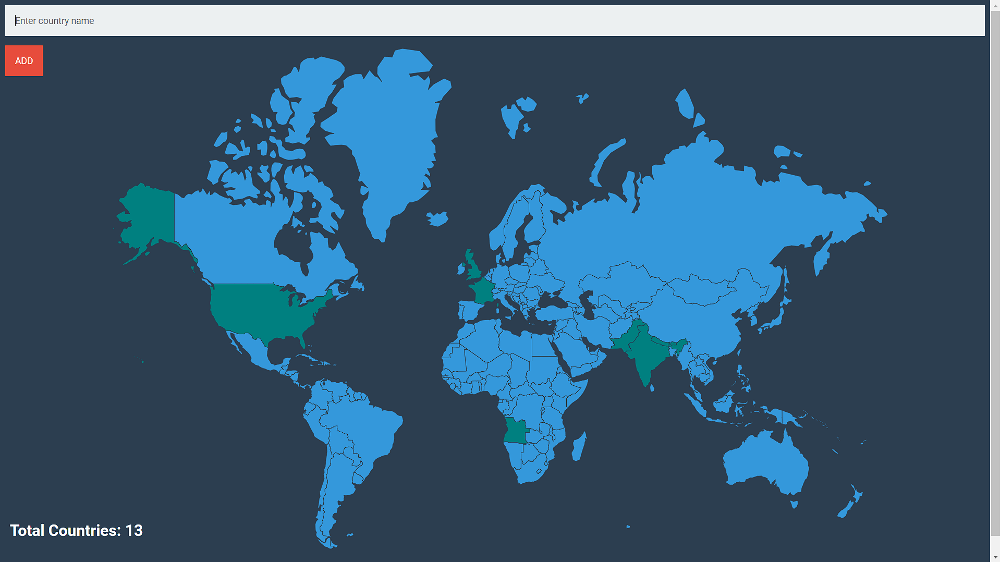

# **Travel Tracker**

**Travel Tracker** is a web application that allows users to track and manage the countries they have visited. Users can add countries to their visited list, and the application will visually represent the visited countries on a world map.

## Features

- **Country Tracking:** Easily add countries to your visited list.
- **Interactive Map:** Visual representation of visited countries on an interactive world map.
- **Total Count:** Display the total number of countries visited.

## Getting Started

### Prerequisites

- [Node.js](https://nodejs.org/) installed
-  [PostgreSQL](https://www.postgresql.org/) database 

### Installation

1. Clone the repository:

   ```bash
   git clone https://github.com/trigunom/Travel_Tracker.git

   ```

2. Navigate to the project directory:

```bash
cd project-directory
```

3. Install dependecies:

  ```bash
  npm i
  ```

4. Set up the database:

  - Create a PostgreSQL database named `world`.
  - Create two tables in the new database:
  
  Table 1 : `countries`
  | id [pk]         | country_code     | country name |
  | -----------     | -----------      |---------     |

  Import the provided csv file `countries.csv` to finsh setting up the table.

  Table 2: `visited_countries`
  | id [pk]         | country_code     | 
  | -----------     | -----------      |

  `Note : This table will be used to keep track of the visited    countries.`

5. Update the PostgreSQL connection details in `index.js` to match your local setup:

  ```
const db = new pg.Client({
  user: "your_username",
  host: "localhost",
  database: "world",
  password: "your_password",
  port: 5432,
});
```
## Usage

1. Start the server:
  ```bash
  npm index.js
  ```

2. Open your web browser and go to `http://localhost:3000`

3. Enter the name of the country you want to add and click the `Add` button.

## Technologies

- **Node.js:** Server-side JavaScript runtime.
- **Express:** Web application framework for Node.js.
- **PostgreSQL:** Open-source relational database.
- **HTML, CSS, EJS:** Front-end technologies for building the user interface.

## UI



